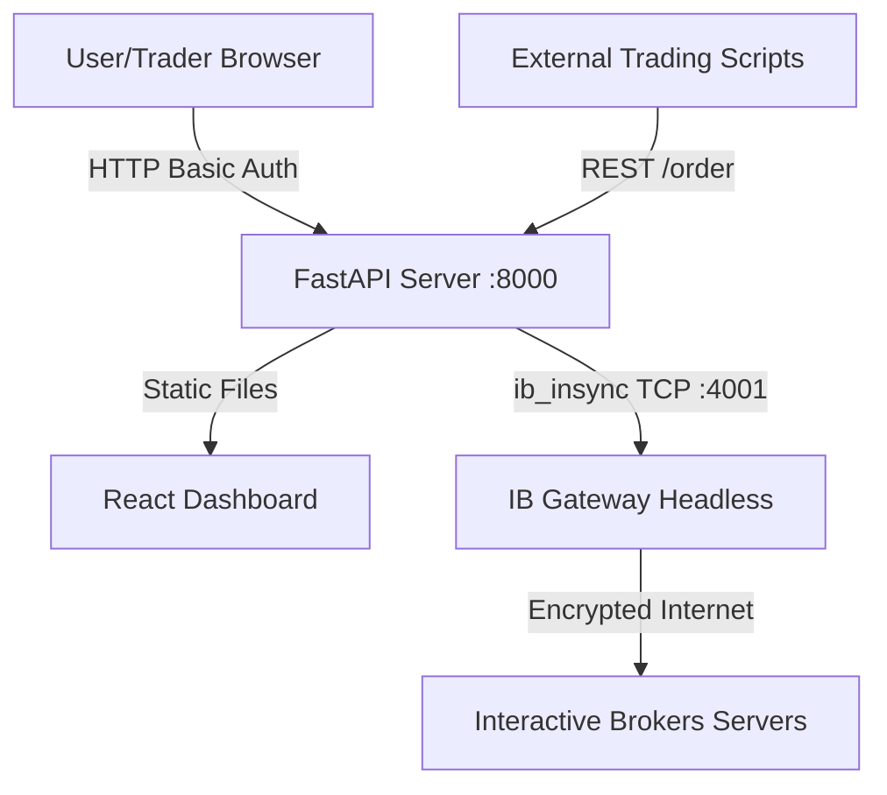

# Product & Architecture Vision

## 1. The Bigger Goal (Product Vision)
The ultimate goal of this project is to build a **fully autonomous, cloud-native remote trading dashboard** for Interactive Brokers (IBKR). 

Historically, trading with IBKR requires a human to manually launch their clunky Java desktop application (TWS), log in with a physical 2FA device every 24 hours, and keep their computer running indefinitely. 

Our goal is to completely eliminate this friction by building a "set-it-and-forget-it" headless system. This application is designed to be pushed to a cloud provider (like Render or AWS), automatically log itself in, expose a modern REST API, and provide a beautiful, responsive web dashboard so the user can monitor their portfolio and manually trade from anywhere in the world, on any device.

## 2. The Industry Standard
In the institutional trading world, hedge funds use the FIX (Financial Information eXchange) protocol over dedicated leased lines to execute trades directly with exchanges. 

For advanced retail traders and proprietary trading firms using IBKR, the industry standard architecture is exactly what we are building:
- **Containerized Headless Gateway:** Using Docker and IBC (IB Controller) to run the IB Gateway without a GUI (using a virtual framebuffer like Xvfb) to bypass the daily manual login requirement.
- **API Abstraction Layer:** Wrapping the raw, complex TCP socket protocol of IBKR with a modern, stateless REST/WebSocket API (in our case, Python/FastAPI) so that trading algorithms can be written in any language and remain entirely decoupled from the broker's underlying quirks.
- **Single Page Application (SPA):** A React/Vue dashboard that consumes the API to provide a unified risk-management interface. 
- **Security:** Zero-trust principles, enforcing HTTP Basic Auth or Bearer tokens for all endpoints, especially since cloud environments are exposed to the public internet.

## 3. What We Have Achieved So Far
We have successfully constructed the foundational architecture that adheres precisely to the industry standard.

### Milestones Completed:
- ✅ **Backend API:** Built a robust Python FastAPI server using `ib_insync` to manage the asynchronous socket connection to IBKR. Implemented endpoints for fetching portfolios, historical data, and executing live orders.
- ✅ **Frontend Dashboard:** Built a modern, dark-mode React (Vite) Single Page Application that consumes the API to display account health, open positions, and a real-time watchlist.
- ✅ **The "All-in-One" Container:** Engineered a multi-stage Dockerfile that compiles the React frontend, installs the Python backend, and launches the IB Gateway via IBC.
- ✅ **Single Origin Serving:** Configured FastAPI to mount the compiled React assets statically, meaning the API and the UI run on the exact same port (8000), eliminating CORS issues entirely.
- ✅ **Security:** Implemented global HTTP Basic Authentication to protect both the API and the UI from unauthorized internet access.
- ✅ **Cloud-Ready:** Authored a `render.yaml` configuration file for immediate, 1-click continuous deployment to the Render cloud platform.

## 4. Architecture Data Flow

## 5. Next Steps
With the infrastructure completely solved, the next phase is purely functional:
1. **Epic 1:** Adding interactive UI controls to modify/cancel active orders.
